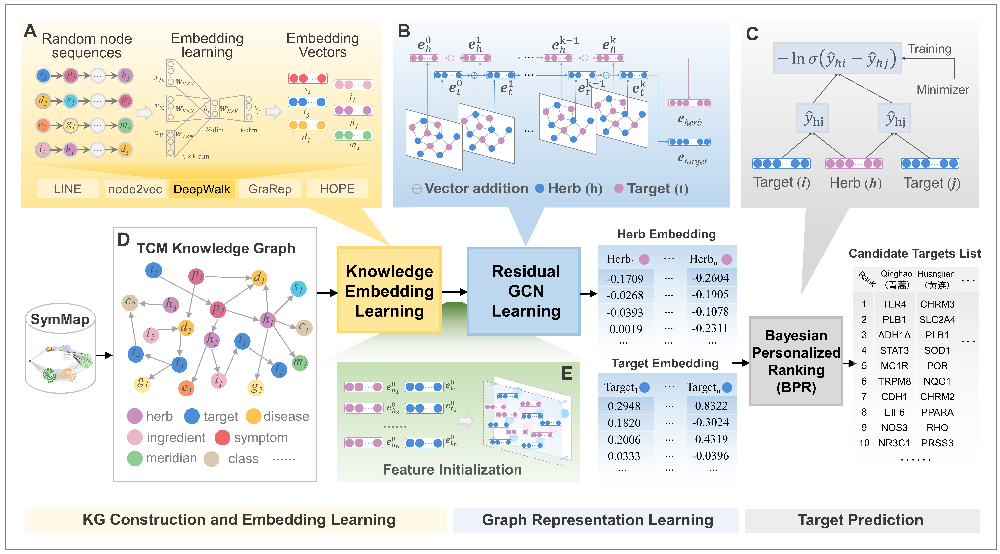

# HTINet2: Herb Target Prediction via Knowledge Graph Embedding and Residual-like Graph Neural Network

## Overview
We proposed a deep learning-based target prediction framework termed HTINet2, which designed three key modules, namely, KG Construction and Embedding Learning, Graph Representation Learning, and Target Prediction.




## Environment Requirement
If you want to use env of anaconda:
```
conda create -n HTINet2
conda activate HTINet2
pip install -r requirements.txt
```

## Usage

### Knowledge Embedding

The TMKG knowledge graph we constructed comes frome multiple sources. These databases include SymMap, soFDA, STRING v11, KEGG, GO of gene ontology, the TCM books consist of “ChP 2020”, “100 Classic Famous Formulas”, “TCM Diagnostics”, “Treatise on Febrile Diseases”, “Formulas of TCM”, and “Internal and External Women and Children’s Diseases”.

Using [OpenNE](https://github.com/thunlp/OpenNE) methods to learn the deep knowledge embedding of TMKG for herbs and targets. The output using LINE method is located at `/Knowledge_embedding`.

### Graph Representation

#### Dataset
- training dataset `training_set.npy`, testing dataset `testing_set.npy`, validation dataset `val_set.npy`, they all contain three parts, the genes corresponding to herbs, the herbs corresponding to genes, and the total number of genes corresponding to herbs. All dataset `set_all.npy` is all genes corresponding to herbs.
- in datasets, each id represents a herb or target. The relationship between the id and their names can be found in `name2id`.
- graph representation component inspired by [LR-GCCF](https://github.com/newlei/LR-GCCF), and the initialized embeddings of GNN are the result of pre-training of the Knowledge Embedding module `/Knowledge_embedding/herb_LINE.txt` and `/Knowledge_embedding/gene_LINE.txt`.

#### Running

- train

```
cd code
python train.py
```

- test
```
cd code
python test.py
```

To adjust the dimension of the model, it is necessary to also modify the dimension of the pre-training embeddings in the Knowledge Embedding stage. This step ensures consistency of embedding dimensions within the framework, especially since the framework is not end-to-end.